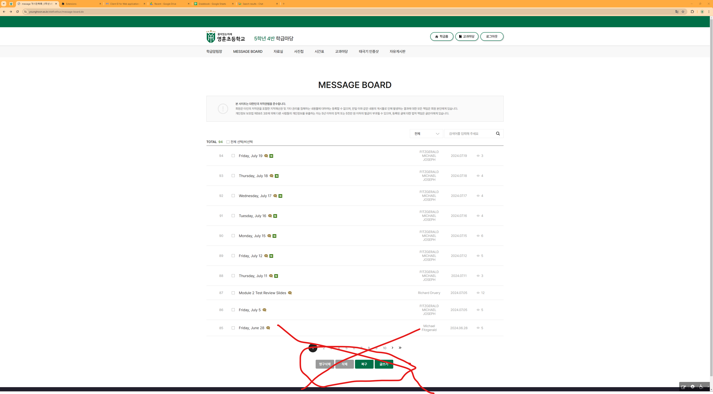
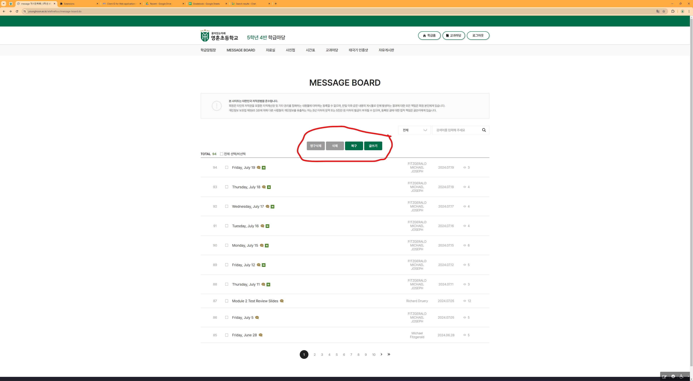

# Message Board Button Mover

This extension relocates the message board action buttons from the bottom of the table to the top, making them more accessible. You no longer have to scroll to the bottom to create a new post! See below for images.

## Images

### Before

### After

## FAQ

1. Why is this not on the Chrome Web Store?
    - Because it costs 5 USD to activate an account. Maybe we can get YHES to pay for it? 🤞
